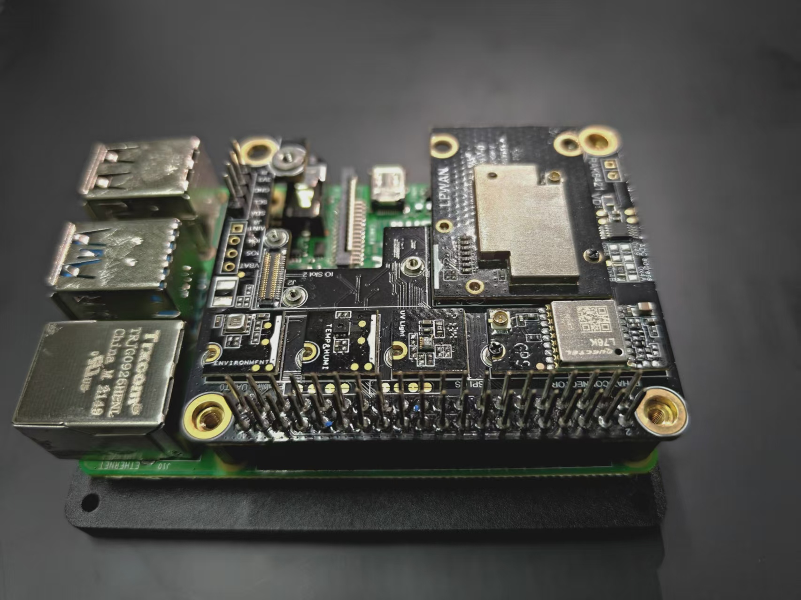
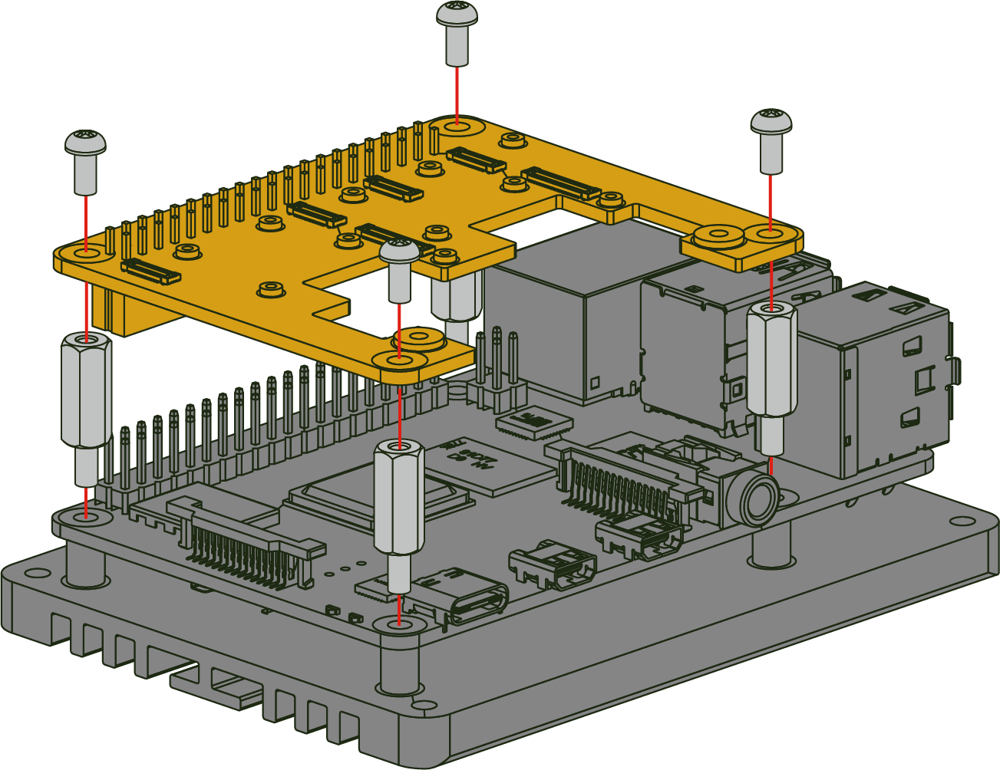

# Meshtastic Environment Monitoring System with RAK6421 WisMesh Pi HAT

> **Note:** This document targets **meshtasticd 2.7.15 only**. RAK1906 and RAK1901 sensors are not yet fully supported in this version. Please run `sudo cp /etc/meshtasticd/available.d/lora-RAK6421-13300-slot1.yaml /etc/meshtasticd/config.d/` before everything. The examples use **RAK12019** as a reference (supported in 2.7.15). This documentation and code will be updated once Meshtasticd adds full RAK1906/RAK1901 support (expected soon).

Transform your Raspberry Pi + RAK 6421 WisMesh Pi HAT + RAK Wisblock sensors into a complete environment monitoring station with real-time visualization.


## Overview

This solution uses meshtasticd's built-in MQTT functionality to collect environment data (temperature, humidity, pressure, air quality) from RAK sensors and visualize it in Grafana.

#### Data Flow

```
┌─────────────────┐     ┌─────────────────┐     ┌─────────────────┐
│   RAK1906/1901  │────▶│   meshtasticd   │────▶│   Mosquitto     │
│   Environment   │ I2C │        Daemon   │MQTT │   MQTT Broker   │
│     Sensors     │     │                 │     │   Port 1883     │
└─────────────────┘     └─────────────────┘     └────────┬────────┘
                                                         │
                                                         ▼
┌─────────────────┐     ┌─────────────────┐     ┌─────────────────┐
│     Grafana     │◀────│    InfluxDB     │◀────│    Node-RED     │
│  Visualization  │Query│  Time-series DB │Write│   JSON Parser   │
│   Port 3000     │     │   Port 8086     │     │   Port 1880     │
└─────────────────┘     └─────────────────┘     └─────────────────┘
```

---

## About RAK6421 WisMesh Pi HAT



#### Assembly
To assemble the board on top of the Raspberry Pi or other compatible devices, please follow the steps bellow:

- Assemble first the modules or sensors you are going to use on the Pi HAT, using the screws provided with the modules to secure them in place.
- If any of the modules require an antenna, plug the antenna before mounting the hat on the Raspberry Pi.
- Make sure the host device (Raspberry Pi or equivalent) is power off and unplugged to avoid shorts during the assembly process.
Use spacers to ensure proper alignment and distance between the hat and the main board, secure them with matching screws and/or nuts.



#### How WisMesh Pi HAT Fits Into a Meshtastic Raspberry Pi Build

The RAK6421 WisMesh Pi HAT provides a complete integration layer for building a Meshtastic node on Raspberry Pi:

**System Architecture:**
- **Hardware Layer:** The HAT connects directly to the Pi GPIO header, providing a fixed integration from the Pi to the LoRa radio module and I2C sensors
- **Software Layer:** meshtasticd runs on Linux and interfaces with supported radios and HATs through standard protocols
- **Gateway Capabilities:** This setup can function as a full mesh gateway by combining meshtasticd with MQTT, Node-RED, InfluxDB, and Grafana for data automation and visualization

#### HAT+ EEPROM Auto-Discovery

The RAK6421 includes an onboard EEPROM that enables meshtasticd to automatically detect and configure the HAT:
- **Plug-and-Play:** No manual hardware configuration needed
- **Instant Recognition:** The system identifies the LoRa radio and connected sensors automatically
- **Zero Configuration Start:** After installing the HAT, you can immediately access the meshtasticd web client or connect via the mobile app

> **Note:** For the HAT's EEPROM to be recognized by the Raspberry Pi, add the following to `/boot/firmware/config.txt` (or `/boot/config.txt` on some images). This enables the I2C-0 bus used by the EEPROM:
> ```
> # Enable I2C-0 bus2216
> dtparam=i2c_vc=on
> dtoverlay=i2c0
> ```
> A reboot is required after editing the file. If you use the RAKwireless-provided image, no change is needed—the image already includes this configuration.

#### What This Guide Provides

**Quick Start vs. Full Setup:**

- **Basic Usage (Plug-and-Play):** If you only need basic Meshtastic functionality and don't require environment monitoring, you can use the Raspberry Pi firmware provided by RAK/Meshtastic. Simply assembly the HAT and the LoRa module, and you're ready to:
  - Access the meshtasticd web client at `https://<Pi-IP>:9443`.
    > **Note:** If you are using your own image or the Meshtastic mPWRD-OS, ensure that the following line is uncommented in the `Webserver` section of `/etc/meshtasticd/config.yaml`:  
    > `Port: 9443  # Port for Webserver & Webservices`
  - Or, connect via the Meshtastic mobile app to your device on the LAN if you don't need to use the web client.
  - Send messages and participate in the mesh network.
- **Advanced Setup (This Guide):** This guide walks you through setting up a complete environment monitoring station with:
  - Environment telemetry collection (temperature, humidity, pressure, air quality)
  - GPS location services
  - Real-time data visualization in Grafana
  - MQTT integration for automation
  - Historical data storage in InfluxDB

The goal is to get you up and running with a full-featured monitoring system in the shortest time possible.

---

## Installation

#### Slot Layout

The RAK6421 WisBlock Pi HAT provides **2 IO slots** and **4 sensor slots** for modular expansion:

- **IO Slots (1 & 2):** Use these for LoRa radio modules such as **RAK13300** or **RAK13302** (1W Module). These slots provide the connectivity needed for mesh networking.

- **Sensor Slot A:** Has enough space for long modules. This slot is ideal for placing the **RAK12501** (or RAK12500) GNSS/GPS module.

- **Sensor Slots B, C, D:** Use these for environmental and other sensors. Examples include **RAK1901** (humidity), **RAK1906** (temp/humidity/pressure/air quality), and other compatible WisBlock sensor modules.

> **Note:** The pin layouts for each slot are slightly different. For details on pin definitions and connectors, refer to the [RAK6421 WisBlock Pi HAT Datasheet](https://docs.rakwireless.com/product-categories/wishat/rak6421-wisblock-pi-hat/datasheet/#schematics).


#### Meshtasticd-Supported WisBlock Modules

The following WisBlock modules have been tested and work with meshtasticd (as of version 2.7.17). We will update this list as new versions are released:

| RAK Name   | Chip / Component   | Measures              | Status  |
|------------|--------------------|-----------------------|---------|
| RAK13000   | Semtech SX1262  | LoRa module            | Yes     |
| RAK13002   | Semtech SX1262, SKY66122 signal booster | LoRa module           | Yes     |
| RAK12002   | Micro Crystal RV-3028-C7 | RTC             | Yes     |
| RAK12003   | Melexis MLX90632   | IR Temperature        | Yes     |
| RAK12019   | Lite On LTR-390UV-01 | UV sensor           | Yes     |
| RAK12020   | AMS TSL25911FN     | Ambient light         | Yes     |
| RAK12034   | BMX160             | 9-axis Accelerometer  | Yes     |
| RAK12037   | Sensirion SCD30    | CO2                   | PR ongoing |
| RAK12500   | u-blox ZOE-M8Q     | GNSS GPS Location         | Yes |
| RAK12501   | Quectel L76K   |  GNSS GPS Location         | Yes |
| RAK1902    | STMicro LPS22HB    | Barometric Pressure   | Release soon     |
| RAK1901    | Sensirion SHTC3   | Temp,Humility   | Release soon    |
| RAK1906    | BME680             | Temmperature, Hmmility, Pressure,VOC gas sensing | Release soon     |

---

## Prerequisites

| Requirement | Details |
|-------------|---------|
| **Hardware** | Raspberry Pi 4 |
| **OS** | See [Base image options](#base-image-options) below |
| **Hat** | RAK6421 WisMesh Pi HAT|
| **Sensors and radio module** | RAK1906 (BME680) + RAK1901 (SHTC3) + RAK13300/RAK13302 |

#### Base Image Options

You can run this guide on any Linux image that has meshtasticd installed and working with the RAK6421 WisMesh Pi HAT. Choose one of the following:

| Option | Description |
|--------|-------------|
| **Meshtastic Linux docs** | Follow the [meshtasticd Linux installation](https://meshtastic.org/docs/software/linux/installation/) to install meshtasticd on your preferred distro (e.g. Raspberry Pi OS). You manage the base system yourself. |
| **mPWRD OS (Armbian)** | Build a custom Armbian image with Meshtastic integration using [mPWRD-userpatches](https://github.com/mPWRD-OS/mPWRD-userpatches) (Armbian + Meshtastic). Use `config-raspberry-pi-64bit.conf` for Raspberry Pi. See the repo for build steps. |
| **RAKwireless image** | Use the dedicated firmware from RAKwireless (based on [pi-gen](https://github.com/RPi-Distro/pi-gen)), which includes meshtasticd and is ready for the RAK6421. Easiest path if you want a pre-built Pi image. |

This guide’s scripts assume a Linux system with meshtasticd already running; they add MQTT broker, Node-RED, InfluxDB, and Grafana on top.

---

## Verify LoRa Radio (Before Installation)

**Before running the installation scripts**, we recommend using the Meshtastic web client（or the Meshtastic Python CLI）to confirm that:
1. The LoRa radio module (RAK13300/RAK13302) is enabled and working
2. You can control the node through the web interface

This verification helps ensure your hardware is properly set up before installing Node-RED, InfluxDB, Grafana, and other software.

#### Connect to Your Device

1. Open the Meshtastic web client in a browser from any device on your LAN. The URL is `https://<Pi-IP>:9443`, where `<Pi-IP>` is your Raspberry Pi's IP address (e.g., run `hostname -I` on the Pi to find it). RAKPiOS includes the web client by default.

2. Click **"+ New Connection"**:

   

3. In the connection dialog, select **HTTP** and enter your device's IP address and port (e.g., `10.2.13.62:9443`), then click **Connect**:

   

4. Once connected, go to **Config** → **Radio Config** → **LoRa** tab to view and adjust LoRa radio settings.

   

You can also use this web interface to configure the node, view messages, check the map, and manage channels—without needing the Python CLI or other tools.

---

## Quick Start (One-Command Installation)

The fastest way to get started is to run the complete installation script:

```bash
cd setup/scripts
./install-all.sh
```

This script will install all components in the correct order and takes approximately 20-30 minutes (depending on your network speed). Use `./install-all.sh --skip-serial` to skip serial port configuration if you are not using a GPS module.

> **Tip:** Before running, you can customize credentials in `setup/config/credentials.env`

Edit `config/credentials.env` before running installation scripts:

```bash
# InfluxDB Configuration
INFLUXDB_USERNAME="admin"
INFLUXDB_PASSWORD="your_secure_password"
INFLUXDB_ORG="meshtastic"
INFLUXDB_BUCKET="meshtastic"

# Grafana Configuration
GRAFANA_ADMIN_USER="admin"
GRAFANA_ADMIN_PASSWORD="your_secure_password"
```
---

## Step-by-Step Installation

If you prefer to install components individually or need more control, follow these steps:

#### Step 1: Configure Serial Port (Optional)

```bash
cd setup/scripts
./01-configure-serial.sh
```

This configures the serial port for the Meshtastic GPS module (UART enabled, serial console disabled) and also updates `/etc/meshtasticd/config.yaml` by **uncommenting** common required lines (only if they are currently commented), including:
- `GPS.SerialPath: /dev/ttyS0`
- `I2C.I2CDevice: /dev/i2c-1`
- `Webserver.Port: 9443`

A reboot is required for changes to take effect.

If you'd rather make these edits yourself, see [`config.yaml`](./config.yaml) in this repository for an example configuration.

Each of the following service scripts (Mosquitto, InfluxDB, Node-RED, Grafana) installs its own dependencies when run standalone, so you can run any step independently.

#### Step 2: Install Mosquitto MQTT Broker

```bash
./02-install-mosquitto.sh
```

The MQTT broker receives messages from meshtasticd on port 1883.

> **Note:** Install the MQTT broker first before configuring telemetry settings. The Meshtastic device needs a working MQTT broker connection to successfully apply MQTT-related configurations.

#### Step 3: Configure Telemetry & MQTT

```bash
./03-configure-telemetry.sh
```

This script will use the Meshtastic Python CLI to configure:
- Environment telemetry (sensor data collection)
- GPS/position mode and broadcast settings
- MQTT: enabled, broker address (default `localhost`), JSON output enabled
- Channel 0 uplink enabled (required for MQTT publishing)

> **Important:** Before running this script, ensure your MQTT broker is running and accessible. The script will configure MQTT settings on your Meshtastic device, which requires a working MQTT connection. If you use a remote MQTT broker instead of the local one from Step 2, edit the script to set the correct MQTT address, or configure it manually as described below.

**If you configure manually** (via the Meshtastic web client, mobile app, or Python CLI instead of this script), you must enable the same options:
- **MQTT:** enable MQTT, set the broker address (e.g. `localhost` or your remote broker), enable JSON packets
- **Channel 0:** enable uplink for the primary channel (e.g. with the CLI: `meshtastic --ch-set uplink_enabled true --ch-index 0`)
- **Telemetry:** enable environment measurement and set update interval as needed
- **Position:** set GPS mode and position broadcast options as needed 

#### Step 4: Install InfluxDB

```bash
./04-install-influxdb.sh
```

Default configuration:
| Setting | Value |
|---------|-------|
| Username | admin |
| Password | meshtastic |
| Organization | meshtastic |
| Bucket | meshtastic |

> **Note:** Customize these in `config/credentials.env` before installation.

#### Step 5: Install Node-RED

```bash
./05-install-nodered.sh
```

> **Important:** This step takes 20-30 minutes on slower Pi models.

#### Step 6: Install Grafana

```bash
./06-install-grafana.sh
```

---

## Post-Installation Configuration

#### Configure Node-RED InfluxDB Token

After installation, you need to configure the InfluxDB token in Node-RED:

**1. Get the token:**
```bash
./show-token.sh
```

**2. Open Node-RED** at `http://<Pi-IP>:1880` (from any device on your LAN)

**3. Double-click the "Write to InfluxDB" node:**


**4. Click the pencil icon next to "Local InfluxDB" and paste the token:**


**5. Click "Update", then "Done", then click "Deploy":**


---

## Verify Installation

#### Check Service Status

```bash
rak@rakpios:~/setup/scripts $ ./check-services.sh 
==========================================
Meshtastic Monitoring System Service Status
==========================================

--- Meshtastic Daemon ---
✓ meshtasticd is running

--- MQTT Broker ---
✓ Mosquitto is running
  URL: http://<Pi-IP>:1883

--- Node-RED ---
✓ Node-RED is running
  URL: http://<Pi-IP>:1880

--- InfluxDB ---
✓ InfluxDB is running
  URL: http://<Pi-IP>:8086

--- Grafana ---
✓ Grafana is running
  URL: http://<Pi-IP>:3000

==========================================
MQTT Test
==========================================
mosquitto_sub not installed, skipping MQTT test

==========================================
Port Listening Status
==========================================
MQTT (1883):
LISTEN 0      100          0.0.0.0:1883      0.0.0.0:*                                       
Node-RED (1880):
LISTEN 0      511          0.0.0.0:1880      0.0.0.0:*    users:(("node-red",pid=2839,fd=19))
InfluxDB (8086):
LISTEN 0      4096               *:8086            *:*                                       
Grafana (3000):
LISTEN 0      4096               *:3000            *:*                                       

==========================================
Quick Access Links
==========================================
Node-RED:  http://10.2.13.62:1880
InfluxDB:  http://10.2.13.62:8086
Grafana:   http://10.2.13.62:3000
```

#### Access URLs

Access these services from any device on your LAN using `http://<Pi-IP>:<port>`, where `<Pi-IP>` is your Raspberry Pi's IP address.

| Service | URL | Default Login |
|---------|-----|---------------|
| Node-RED | `http://<Pi-IP>:1880` | - |
| InfluxDB | `http://<Pi-IP>:8086` | admin / meshtastic |
| Grafana | `http://<Pi-IP>:3000` | admin / admin |

#### View Dashboard

1. Open Grafana at `http://<Pi-IP>:3000`
2. Login with admin / admin
3. Navigate to **Dashboards** → **Meshtastic** folder
4. Click **Meshtastic Environment Monitor**


---

## Troubleshooting

#### No MQTT Messages?

1. Check if meshtasticd is running:
   ```bash
   systemctl status meshtasticd
   ```

2. Verify MQTT is enabled:
   ```bash
   meshtastic --get mqtt.enabled
   ```

3. Test MQTT subscription (run on the Pi or from another machine on the LAN):
   ```bash
   mosquitto_sub -h <Pi-IP> -t 'msh/#' -v
   ```

#### Node-RED Can't Connect to InfluxDB?

1. Verify InfluxDB is running:
   ```bash
   systemctl status influxdb
   ```

2. Check the token is correct in Node-RED

3. Verify organization name matches (default: "meshtastic")

#### Grafana Shows No Data?

1. Check data source configuration:
   - Go to **Connections** → **Data Sources** → **InfluxDB**
   - Click **Save & Test**

2. Verify data is being written:
   - Open InfluxDB UI at `http://<Pi-IP>:8086`
   - Go to **Data Explorer**
   - Query the "meshtastic" bucket
   

3. Check Node-RED debug output for errors

#### Sensor Data Not Updating?

1. Check sensor connection:
   ```bash
   i2cdetect -y 1
   ```
   Should show address 0x76 for RAK1906（BME680）and 0x70 for RAK1901(SHTC3)

2. View meshtasticd logs:
   ```bash
   journalctl -u meshtasticd -f
   ```

#### Service Management

```bash
# Restart all services
sudo systemctl restart mosquitto nodered influxdb grafana-server

# View logs
journalctl -u meshtasticd -f
journalctl -u nodered -f

# Check status
./scripts/check-services.sh
```

---


## References

- [meshtasticd Linux installation](https://meshtastic.org/docs/software/linux/installation/)
- [Meshtastic Web client](https://meshtastic.org/docs/software/web-client/)
- [Meshtastic Python CLI](https://meshtastic.org/docs/software/python/cli/)
- [Meshtastic Position Configuration](https://meshtastic.org/docs/configuration/radio/position/)
- [Meshtastic Telemetry Configuration](https://meshtastic.org/docs/configuration/module/telemetry/)
- [meshtasticd MQTT Configuration](https://meshtastic.org/docs/configuration/module/mqtt/)


