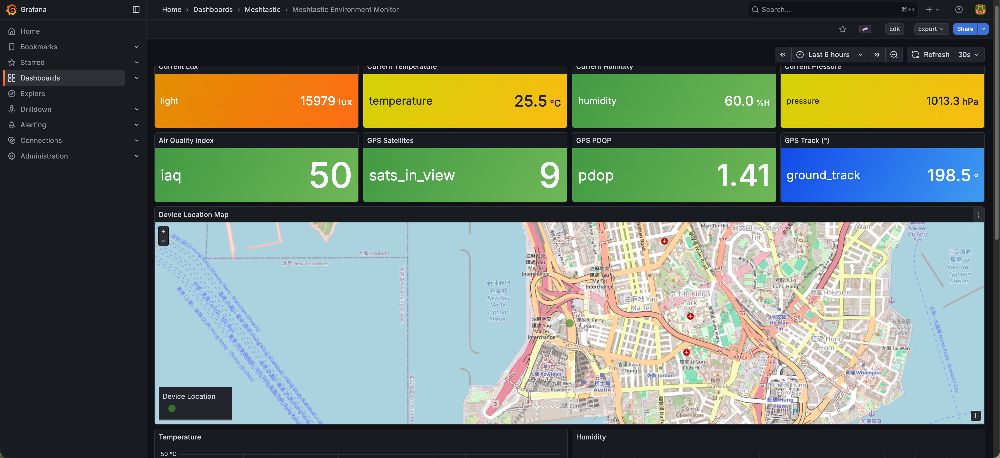
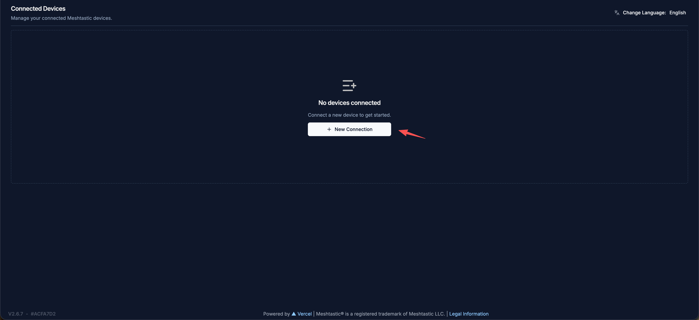
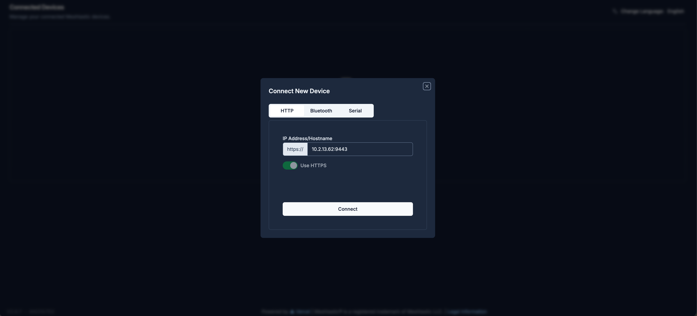
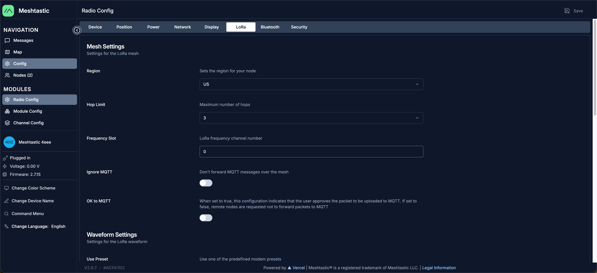
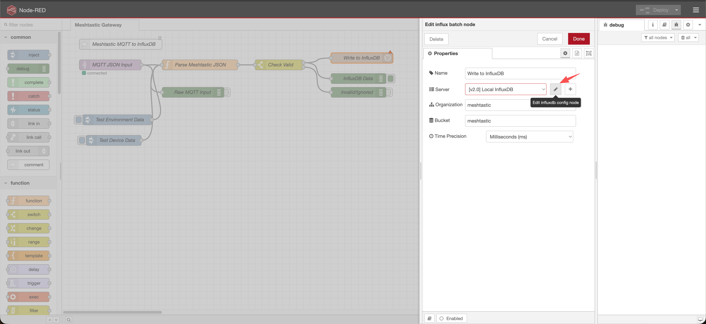
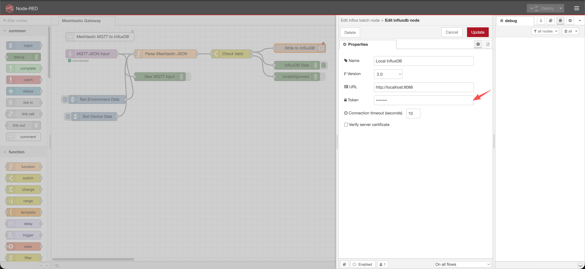
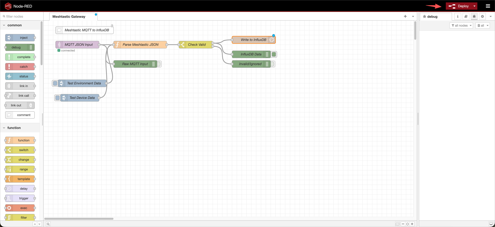
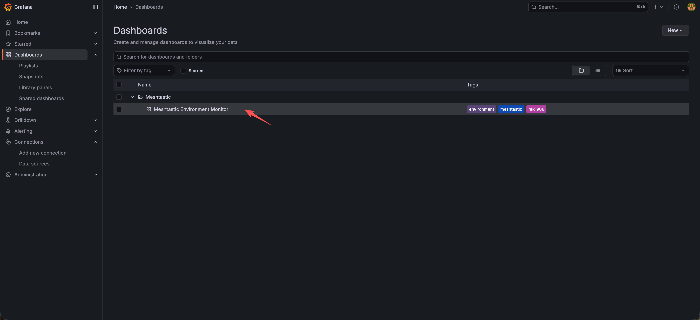
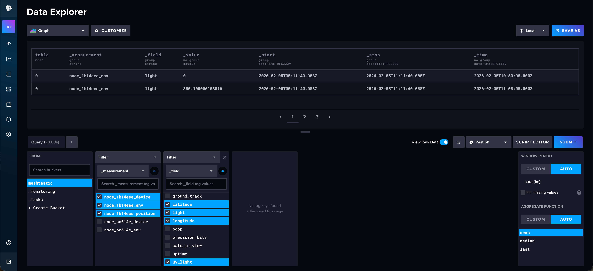

# Meshtastic Environment Monitoring System with RAK6421

> **Note:** This document targets **meshtasticd 2.7.15 only**. RAK1906 and RAK1901 sensors are not yet fully supported in this version. The examples use **RAK12019** as a reference (supported in 2.7.15). The documentation and code will be updated once Meshtastic adds full RAK1906/RAK1901 support (expected soon).

Transform your Raspberry Pi + RAK hardware into a complete environment monitoring station with real-time visualization.



## Overview

This solution uses meshtasticd's built-in MQTT functionality to collect environment data (temperature, humidity, pressure, air quality) from RAK sensors and visualize it in Grafana.

### Data Flow

```
┌─────────────────┐     ┌─────────────────┐     ┌─────────────────┐
│   RAK1906/1901  │────▶│   meshtasticd   │────▶│   Mosquitto     │
│   Environment   │ I2C │        Daemon   │MQTT │   MQTT Broker   │
│     Sensors     │     │                 │     │   Port 1883     │
└─────────────────┘     └─────────────────┘     └────────┬────────┘
                                                         │
                                                         ▼
┌─────────────────┐     ┌─────────────────┐     ┌─────────────────┐
│     Grafana     │◀────│    InfluxDB     │◀────│    Node-RED     │
│  Visualization  │Query│  Time-series DB │Write│   JSON Parser   │
│   Port 3000     │     │   Port 8086     │     │   Port 1880     │
└─────────────────┘     └─────────────────┘     └─────────────────┘
```

---

## Prerequisites

| Requirement | Details |
|-------------|---------|
| **Hardware** | Raspberry Pi 4 |
| **OS** | RAKPiOS meshtasticd version |
| **Hat** | RAK6421 Pi-Hat|
| **Sensors and radio module** | RAK1906 (BME680) + RAK1901 (SHTC3) + RAK13300/RAK13302 |

---

## Verify LoRa Radio (Before Installation)

**Before running the installation scripts**, we recommend using the Meshtastic web client（or the Meshtastic Python CLI）to confirm that:
1. The LoRa radio module (RAK13300/RAK13302) is enabled and working
2. You can control the node through the web interface

This verification helps ensure your hardware is properly set up before installing Node-RED, InfluxDB, Grafana, and other software.

### Connect to Your Device

1. Open the Meshtastic web client in a browser from any device on your LAN. The URL is `https://<Pi-IP>:9443`, where `<Pi-IP>` is your Raspberry Pi's IP address (e.g., run `hostname -I` on the Pi to find it). RAKPiOS includes the web client by default.

2. Click **"+ New Connection"**:

   

3. In the connection dialog, select **HTTP** and enter your device's IP address and port (e.g., `10.2.13.62:9443`), then click **Connect**:

   

4. Once connected, go to **Config** → **Radio Config** → **LoRa** tab to view and adjust LoRa radio settings.

   

You can also use this web interface to configure the node, view messages, check the map, and manage channels—without needing the Python CLI or other tools.

---

## Quick Start (One-Command Installation)

The fastest way to get started is to run the complete installation script:

```bash
cd setup/scripts
./install-all.sh
```

This script will install all components in the correct order and takes approximately 10-20 minutes depends on your network speed.

> **Tip:** Before running, you can customize credentials in `setup/config/credentials.env`

---

## Step-by-Step Installation

If you prefer to install components individually or need more control, follow these steps:

### Step 1: Install Meshtastic Python CLI

```bash
cd setup/scripts
./01-install-meshtastic-python-cli.sh
```

Verify the installation:
```bash
meshtastic --info
```

### Step 2: Configure Telemetry & MQTT

```bash
./02-configure-telemetry.sh
```

This script will use the Meshtastic Python CLI to configure:
- Environment telemetry (sensor data collection)
- MQTT publishing to local broker
- JSON format output for easy parsing

### Step 3: Install Mosquitto MQTT Broker

```bash
./03-install-mosquitto.sh
```

The MQTT broker receives messages from meshtasticd on port 1883.

### Step 4: Install InfluxDB

```bash
./04-install-influxdb.sh
```

Default configuration:
| Setting | Value |
|---------|-------|
| Username | admin |
| Password | meshtastic |
| Organization | meshtastic |
| Bucket | meshtastic |

> **Note:** Customize these in `config/credentials.env` before installation.

### Step 5: Install Node-RED

```bash
./05-install-nodered.sh
```

> **Important:** This step takes 20-30 minutes on slower Pi models.

### Step 6: Install Grafana

```bash
./06-install-grafana.sh
```

---

## Post-Installation Configuration

### Configure Node-RED InfluxDB Token

After installation, you need to configure the InfluxDB token in Node-RED:

**1. Get the token:**
```bash
./show-token.sh
```

**2. Open Node-RED** at `http://<Pi-IP>:1880` (from any device on your LAN)

**3. Double-click the "Write to InfluxDB" node:**



**4. Click the pencil icon next to "Local InfluxDB" and paste the token:**



**5. Click "Update", then "Done", then click "Deploy":**



---

## Verify Installation

### Check Service Status

```bash
rak@rakpios:~/setup/scripts $ ./check-services.sh 
==========================================
Meshtastic Monitoring System Service Status
==========================================

--- Meshtastic Daemon ---
✓ meshtasticd is running

--- MQTT Broker ---
✓ Mosquitto is running
  URL: http://<Pi-IP>:1883

--- Node-RED ---
✓ Node-RED is running
  URL: http://<Pi-IP>:1880

--- InfluxDB ---
✓ InfluxDB is running
  URL: http://<Pi-IP>:8086

--- Grafana ---
✓ Grafana is running
  URL: http://<Pi-IP>:3000

==========================================
MQTT Test
==========================================
mosquitto_sub not installed, skipping MQTT test

==========================================
Port Listening Status
==========================================
MQTT (1883):
LISTEN 0      100          0.0.0.0:1883      0.0.0.0:*                                       
Node-RED (1880):
LISTEN 0      511          0.0.0.0:1880      0.0.0.0:*    users:(("node-red",pid=2839,fd=19))
InfluxDB (8086):
LISTEN 0      4096               *:8086            *:*                                       
Grafana (3000):
LISTEN 0      4096               *:3000            *:*                                       

==========================================
Quick Access Links
==========================================
Node-RED:  http://10.2.13.62:1880
InfluxDB:  http://10.2.13.62:8086
Grafana:   http://10.2.13.62:3000
```

### Access URLs

Access these services from any device on your LAN using `http://<Pi-IP>:<port>`, where `<Pi-IP>` is your Raspberry Pi's IP address.

| Service | URL | Default Login |
|---------|-----|---------------|
| Node-RED | `http://<Pi-IP>:1880` | - |
| InfluxDB | `http://<Pi-IP>:8086` | admin / meshtastic |
| Grafana | `http://<Pi-IP>:3000` | admin / admin |

### View Dashboard

1. Open Grafana at `http://<Pi-IP>:3000`
2. Login with admin / admin
3. Navigate to **Dashboards** → **Meshtastic** folder
4. Click **Meshtastic Environment Monitor**



---

## Configuration

### Custom Credentials

Edit `config/credentials.env` before running installation scripts:

```bash
# InfluxDB Configuration
INFLUXDB_USERNAME="admin"
INFLUXDB_PASSWORD="your_secure_password"
INFLUXDB_ORG="meshtastic"
INFLUXDB_BUCKET="meshtastic"

# Grafana Configuration
GRAFANA_ADMIN_USER="admin"
GRAFANA_ADMIN_PASSWORD="your_secure_password"
```

---

## File Structure

```
setup/
├── README.md                    # This file
├── config/
│   ├── credentials.env          # Customizable credentials
│   └── mosquitto.conf           # MQTT broker configuration
├── scripts/
│   ├── install-all.sh           # Complete installation script
│   ├── 01-install-meshtastic-python-cli.sh
│   ├── 02-configure-telemetry.sh
│   ├── 03-install-mosquitto.sh
│   ├── 04-install-influxdb.sh
│   ├── 05-install-nodered.sh
│   ├── 06-install-grafana.sh
│   ├── check-services.sh        # Service status checker
│   └── show-token.sh            # Display InfluxDB token
├── nodered/
│   ├── flows.json               # Node-RED flow configuration
│   └── settings.js              # Node-RED settings
└── grafana/
    └── dashboard.json           # Grafana dashboard
```

---

## Troubleshooting

### No MQTT Messages?

1. Check if meshtasticd is running:
   ```bash
   systemctl status meshtasticd
   ```

2. Verify MQTT is enabled:
   ```bash
   meshtastic --get mqtt.enabled
   ```

3. Test MQTT subscription (run on the Pi or from another machine on the LAN):
   ```bash
   mosquitto_sub -h <Pi-IP> -t 'msh/#' -v
   ```

### Node-RED Can't Connect to InfluxDB?

1. Verify InfluxDB is running:
   ```bash
   systemctl status influxdb
   ```

2. Check the token is correct in Node-RED

3. Verify organization name matches (default: "meshtastic")

### Grafana Shows No Data?

1. Check data source configuration:
   - Go to **Connections** → **Data Sources** → **InfluxDB**
   - Click **Save & Test**

2. Verify data is being written:
   - Open InfluxDB UI at `http://<Pi-IP>:8086`
   - Go to **Data Explorer**
   - Query the "meshtastic" bucket
   

3. Check Node-RED debug output for errors

### Sensor Data Not Updating?

1. Check sensor connection:
   ```bash
   i2cdetect -y 1
   ```
   (Should show address 0x76 or 0x77 for BME680)

2. View meshtasticd logs:
   ```bash
   journalctl -u meshtasticd -f
   ```

---

## Service Management

```bash
# Restart all services
sudo systemctl restart mosquitto nodered influxdb grafana-server

# View logs
journalctl -u meshtasticd -f
journalctl -u nodered -f

# Check status
./scripts/check-services.sh
```

---


## References

- [meshtasticd Linux installation](https://meshtastic.org/docs/software/linux/installation/)
- [Meshtastic Web client](https://meshtastic.org/docs/software/web-client/)
- [Meshtastic Python CLI](https://meshtastic.org/docs/software/python/cli/)
- [Meshtastic Position Configuration](https://meshtastic.org/docs/configuration/radio/position/)
- [Meshtastic Telemetry Configuration](https://meshtastic.org/docs/configuration/module/telemetry/)
- [meshtasticd MQTT Configuration](https://meshtastic.org/docs/configuration/module/mqtt/)


